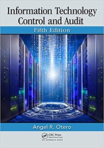
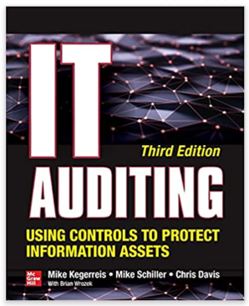

# IS 369: IT Audit and Controls
## Overview
- This course is designed to equip the learner with the requisite knowledge and skills necessary to conduct a successful information systems audit.
- Introduces three typical aspects of information technology (IT) audits: the audits of computerized information systems, the computer facility, and the process of developing and implementing information systems. 
- Through readings, case studies, exercises and discussion, students will learn to plan, conduct and report on these three types of IT audits. Additional topics may include challenges posed by emerging information technologies, advanced audit software, business continuity planning, and the role of the IT auditor as an advisor to management.
## Expected Learning Outcomes
By the end of the course, the learner should be able to
- Apply of risk-oriented audit approaches
- Be familiar with computer-assisted audit tools and techniques
- Be aware of standards (national or international) such as the ISO* to improve and implement quality systems in software development and meet IT security standards
- Understand business roles and expectations in the auditing of systems under development as well as the purchase of software packaging and project management
- Assess information security, confidentiality, privacy, and availability issues which can put the organization at risk
- Examine and verify organization’s compliance with any IT-related legal issues that may jeopardize or place the organization at risk
- Evaluate complex systems development life cycles (SDLC) or new development techniques (i.e., prototyping, end-user computing, rapid systems, or application development)
- Report to management and perform a follow-up review to ensure actions taken at work
## Prerequisite
- N/A
## Delivery Mode
- Lecture + Tutorial (B307)
- Monday: 1300-1500
- Wednesday: 1300-1400
## Assessment
- Coursework: Test + Assignment
- Final Examination

## Course Content

## Reference Books
- Otero, A. R. (2018). Information technology control and audit. CRC Press.
   

- IT Auditing Using Controls to Protect Information Assets, Third Edition by Mike Schiller, Mike Kegerreis and Chris Davis (2019, Trade Paperback)

